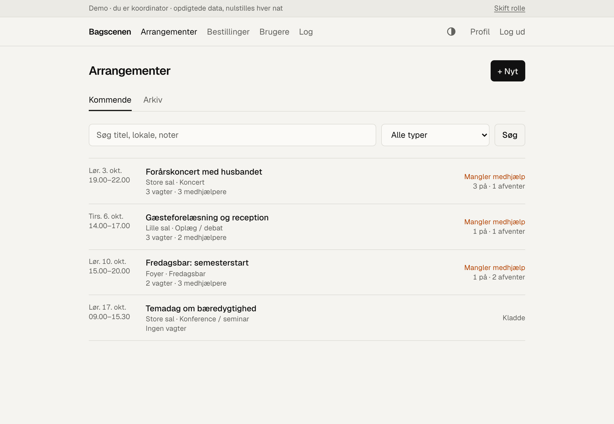
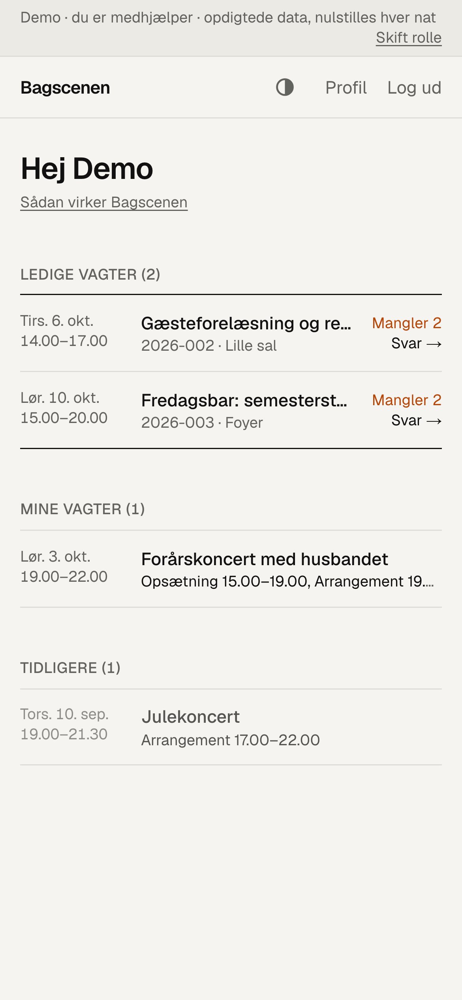
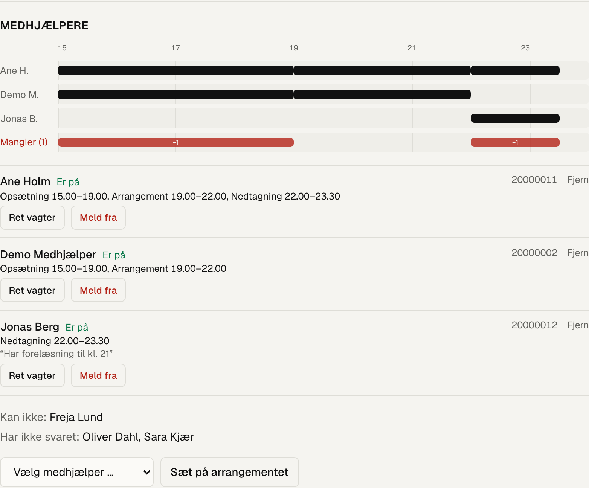
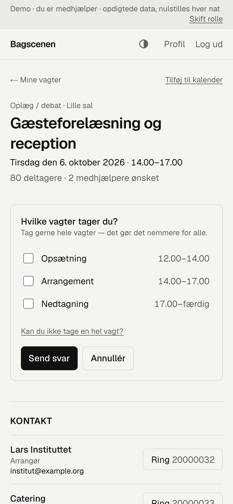
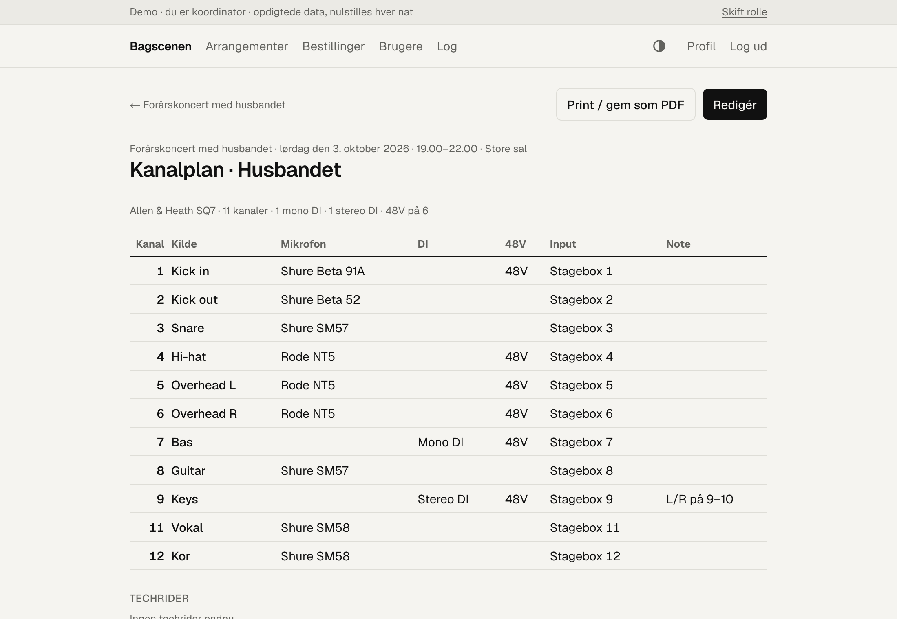

# Bagscenen

**Shift planning for the student helpers who run a university venue's events** — concerts, lectures, receptions,
Friday bars. Built for a venue technician and a team of about ten student helpers.

**Live demo:** https://bagscenen-demo.vercel.app — one click to log in as the coordinator or as a helper. Everything
in the demo is fictional and resets every night. (The app itself is in Danish.)

<p>
  
  
</p>

## The problem

Every event starts with a meeting with the organiser: how big a stage, how many microphones, is there a band, when
do doors open. The technician then has to find student helpers for set-up, the event itself and take-down — and
that used to happen in group chats. Who said yes to what, who could only come after their lecture, and what the
event actually needed got lost between messages.

Bagscenen replaces the chat threads:

- The **coordinator** turns the meeting notes into an event — a form built around the venue's own checklist (stage,
  sound, light, chairs) that only shows the fields that matter — and invites helpers.
- **Helpers** answer from their phone: take whole shifts, or say exactly when they can come ("15–16 and after 17").
- A **timeline** shows who is on when, and a red bar shows where people are still missing.
- Everyone on the event sees the organiser's contact details, each other's phone numbers, and a shared log of what
  was agreed.

## Features



**For the coordinator**
- Event form mirroring the venue's checklist; standard shifts (set-up · event · take-down) generated from the event
  times, including open-ended take-down and "about 2 hours, ready by 19:00" shifts where helpers pick their own start.
- Invite helpers, follow answers, and adjust anyone's shifts. Helpers answer once; changes go through the coordinator.
- Coverage timeline per event and "missing helpers" across the event list.
- **Booking links:** send an organiser a one-time link to fill in the checklist themselves (Danish/English), then turn
  it into an event with one click.
- **Channel plans** for sound — per event and per band: mixer-aware input numbering (stagebox vs. local inputs),
  templates, paste from Excel, DI/48V summary, print-to-PDF with a QR code, and time-limited read-only share links.
- Approve new accounts, assign roles, generate password-reset links, audit log.

**For helpers**
- New invitations first, then "my shifts", then the archive.
- Call or mail the organiser directly; see who else is on and their numbers.
- Add shifts to their calendar (.ics); install the site on the home screen.
- Download their own data, edit it, or delete their account.

<p>
  
  
</p>

## Tech

**Next.js 15** (App Router, Server Actions) · **TypeScript** · **Tailwind CSS 4** · **PostgreSQL** + **Prisma 6** ·
**Auth.js 5** · **Zod** · **Vitest** · **Playwright** · hosted on **Vercel** with **Neon** Postgres (EU region).

There is no separate API: pages are React Server Components that read the database directly, and every mutation is a
Server Action that validates its input with Zod and checks permissions on the server.

```
src/app/(auth)     login, signup, password reset, privacy notice, helper guide
src/app/(app)      the logged-in app: helper views, coordinator (admin) views
src/app/bestil     the organiser's booking form (public, one-time link)
src/app/kanalplan  read-only channel plan behind a signed share link
src/lib            domain logic: events, shifts & coverage, channel plans, auth helpers, retention
prisma/            schema and migrations
e2e/               Playwright tests against a production build
```

## Security and privacy

The app holds personal data about students, so it was designed to store as little as possible and to fail closed.

- **Data minimisation:** first name, last name, university email and phone number — nothing else. Signup is limited
  to the university's email domains, and new accounts wait for a coordinator's approval.
- **Passwords** are hashed with argon2id; common passwords and passwords containing the user's name are rejected.
  Login, signup and password reset are rate-limited.
- **Sessions** are short-lived JWTs that only carry the user id and a session version. Role and status are re-read
  from the database on every request, so disabling someone or changing a password takes effect immediately.
- **Authorisation** lives in one place per concern (`requireUser(role)`, `canViewEvent`, `canEditPlans`), and a helper
  can only read events they were invited to — probing other ids returns the same 404 as a missing event.
- **Share links** for channel plans are HMAC-signed, versioned (revocable) and expire after 8 hours.
- **Uploads** (band tech riders) must really be PDFs, are capped at 4 MB, and are served with a sandboxing CSP.
- **Headers:** a per-request nonce-based Content-Security-Policy, HSTS, `frame-ancestors 'none'`, no `x-powered-by`.
- **GDPR:** a privacy notice, self-service data export and account deletion (anonymised so the event archive stays
  intact), and a nightly retention job that deletes old data automatically.

## Testing

- **Unit tests** (Vitest) for the domain logic: coverage and gaps, shift times, channel-plan parsing and
  paste-from-Excel, validation, date handling.
- **End-to-end tests** (Playwright) against a production build: signup → approval → event with standard shifts →
  invite → a helper answers with split time windows → the coordinator sees the gap; channel plans and QR sharing;
  booking links; session invalidation; the retention job. Each run creates its own throwaway database.
- CI runs lint, type-check, unit tests, `npm audit` and the end-to-end suite on every push.

## Run it locally

Requires Node 24 and Docker.

```bash
cp .env.example .env        # fill in AUTH_SECRET (npx auth secret) and CRON_SECRET (openssl rand -base64 48)
npm install
npm run db:up               # Postgres in Docker on port 5433
npx prisma migrate deploy
npm run seed:demo           # fictional sample data (wipes the local database)
DEMO_MODE=1 npm run dev     # http://localhost:3000 — use the demo buttons on the login page
```

Without `DEMO_MODE`, the app runs normally: sign up with an address on an allowed domain (see `src/lib/org.ts` and
`ALLOWED_EMAIL_DOMAINS`) and make yourself admin with `npm run make-admin -- you@uni.example`.

Tests: `npm test` (unit) and `npm run test:e2e` (end-to-end; needs the Docker database).

## How it was built

I built Bagscenen with AI assistance, using Claude Code (Anthropic's AI coding assistant) as a pair programmer. The
problem, the requirements and the product decisions came from me and the day-to-day work at the venue: what the event
form asks for, how shifts and answers should work, what data to keep and what to leave out. I directed the work
feature by feature, reviewed the result in the app and adjusted it. Much of the code itself was written with the
assistant.

## About the demo

This repository is the portfolio copy of an app that runs for real at a university venue. The organisation-specific
details live in a single file (`src/lib/org.ts`), which is neutral here. The demo runs the same code with
`DEMO_MODE=1`: one-click logins into two shared accounts, no signup or uploads, and the nightly job reloads the sample
data instead of running the retention clean-up.
